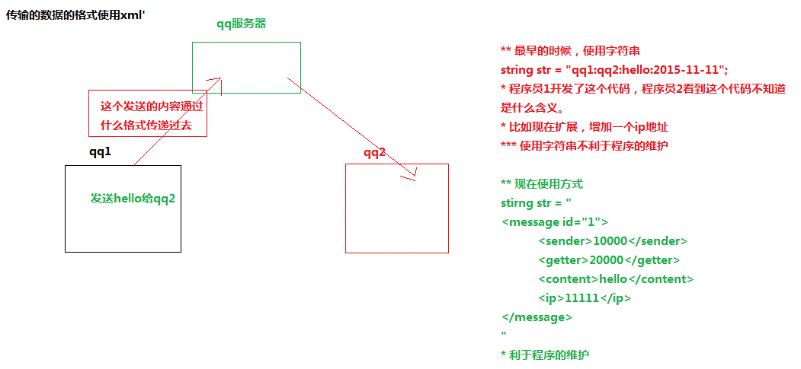

# XML

- [XML](#xml)
    - [简介](#简介)
    - [XML语法](#xml语法)
        - [文档声明](#文档声明)
        - [标签定义](#标签定义)
        - [属性定义](#属性定义)
        - [特殊字符](#特殊字符)
        - [CDATA区（了解）](#cdata区了解)
        - [PI指令](#pi指令)
    - [XML的约束](#xml的约束)
        - [简介](#简介-1)
            - [dtd快速入门（了解会读即可）](#dtd快速入门了解会读即可)
                - [定义元素](#定义元素)
                - [定义属性](#定义属性)
                - [联系DTD和XML](#联系dtd和xml)
    - [XML的解析](#xml的解析)
        - [JAXP的API](#jaxp的api)
        - [JAXP操作XML的步骤](#jaxp操作xml的步骤)
        - [使用dom4j解析xml（重要）](#使用dom4j解析xml重要)
            - [步骤](#步骤)
                - [得到`Document`对象](#得到document对象)
                - [回写XML](#回写xml)
                - [得到`Element`对象](#得到element对象)
                - [插入操作](#插入操作)
                - [删除操作](#删除操作)
    - [XPATH](#xpath)
        - [语法](#语法)
        - [使用dom4j支持XPATH](#使用dom4j支持xpath)
    - [案例](#案例)

<!-- /TOC -->

## 简介
Extensible Markup Language：可扩展标记型语言

- 标记型语言
- 可扩展
    - html里面的标签是固定，每个标签都有特定的含义 `<h1></h1>`
    - 标签可以自己定义,可以写中文的标签 `<person></person> <猫></猫>`

**主要功能：** 存储数据

有两个版本 1.0 1.1，使用都是 1.0 版本，因为 1.1 版本不能向下兼容

**应用**

- 不同的系统之间传输数据（例如QQ间的信息传输）

- 用来表示生活中有关系的数据（因为标签可以自己定义）
- 经常用于文件配置
    - 比如现在连接数据库 肯定知道数据库的用户名和密码，数据名称
    - 如果修改数据库的信息，不需要修改源代码，只要修改配置文件就可以了

## XML语法

### 文档声明

XML文件的第一行必须是文档声明，格式如下：
```xml
<?xml version="1.0" encoding="gbk"?>
```

**属性**

- version：xml的版本 1.0(使用) 1.1
- encoding：xml编码 gbk  utf-8  iso8859-1(不包含中文)
- standalone：是否需要依赖其他文件 yes/no

**xml的中文乱码问题解决：**
文档的保存编码和文档声明设置的编码一致

### 标签定义

- 标签定义有开始必须要有结束：`<person></person>`
- 标签没有内容，可以在标签内结束：`<aa/>`
- 标签可以嵌套，必须要合理嵌套
    - 合理嵌套 `<aa><bb></bb></aa>`
    - 不合理嵌套 `<aa><bb></aa></bb>`（这种方式是不正确的）
- 一个xml中，**只能有一个根标签**，其他标签都是这个标签下面的标签
- 在xml中把空格和换行都当成内容来解析

```xml
<!-- 下面这两段代码含义是不一样的 -->
<aa>1111111</aa>
 
<aa>
    11111111111
</aa>
```

- xml标签可以是中文
- xml中标签的名称规则
    - xml代码区分大小写
    - xml的标签不能以数字和下划线开头
    - xml的标签不能以xml、XML、Xml等开头
    - xml的标签不能包含空格和冒号

### 属性定义
属性定义的要求

- 一个标签上可以有多个属性：`<person id1="aaa" id2="bbb"></person>`
- 属性名称不能相同
- 属性名称和属性值之间使用 '=' ，属性值使用引号包起来（可以是单引号，也可以是双引号）
- xml 属性的名称规范和元素的名称规范一致

### 特殊字符

|字符|转义字符|
|----|--------|
| <  |`&lt;`  |
| >  |`&gt;`  |
| &  |`&amp;` |
| "  |`&quot;`|
| '  |`&apos;`|

### CDATA区（了解）
可以解决多个字符都需要转义的操作，如`if(a<b && b<c && d>f) {}`，它会把把特殊字符，当做文本内容，而不是标签。

**写法：**`<![CDATA[ 内容  ]]>`
```xml
<![CDATA[<b>if(a<b && b<c && d>f) {}</b>]]>
```

### PI指令
Processing Instruction，处理指令，用来指挥 XML 解析器如何解析 XML 文档。
**写法：** `<?xml-stylesheet type="text/css" href="css的路径"?>`
`href`属性中放着代表标签样式的 css 文件，然后当前的 XML 文档中的对应标签就会按照 css 文件中设置的相应样式显示。

例如：
```css
/* 1.css */
name { background-color: red; }
age { background-color:green; }
```

```xml
<?xml version="1.0" encoding="utf-8"?>
<?xml-stylesheet type="text/css" href="1.css"?>
<person>
    <name>zhangsanzhangsanzhangsanzhangsan</name>
    <age>20202020202020202020</age>
</person>
```

## XML的约束

### 简介
因为XML是可以自定义标签的，所以会导致使用这个XML文档的应用程序根本不知道里面有什么标签，所以要加约束。

**对于有约束的XML文档，只能使用约束中创建的元素和属性。**
XML的约束是用另一个文件来约束XML文档的结构。

约束文件的格式：dtd (old, .dtd), schema (now, 本身也是XML文档)

#### dtd快速入门（了解会读即可）

XML中有几个元素，dtd中就有几个`<!ELEMENT>`

##### 定义元素

- 复杂元素：有子元素的元素`<!ELEMENT 元素名称 (子元素1,子元素2,...)>`
    - 表示子元素出现的次数
        - 无：子元素只能出现一次
        - `+`：表示一次或者多次
        - `?`：表示零次或者一次
        - `*`：表示零次或者多次
    - 子元素直接使用`,`进行隔开，代表子元素出现的顺序
    - 子元素直接使用`|`隔开，表示子元素只能出现其中的任意一个
- 简单元素：没有子元素`<!ELEMENT 元素名称 (#PCDATA)>`
    - `(#PCDATA)`: 约束name是字符串类型
    - `EMPTY`：元素为空（没有内容）
    - `ANY`：任意

##### 定义属性

```
<!ATTLIST 元素名称
    属性名称1 属性类型 属性的约束
    属性名称2 属性类型 属性的约束
 >
```

- 属性类型
    - `CDATA`：属性值为任意文本数据
    - `Enumerated`：属性值必须是枚举列表中的一个
        - 在写属性类型的位置写：`(AA|BB|CC)`，这个就是我们的枚举列表
    - `ID`：属性值唯一，即不能和其他同名标签的属性值相同，且不能以数字开头
- 设置说明
    - `#REQUIRED`：该属性是必须有的
    - `#IMPLIED`：该属性使可选的，可有可没有

##### 联系DTD和XML

- XML文件中引入dtd文件：`<!DOCTYPE 根元素名称 SYSTEM "dtd文件的路径">`
- 直接在XML文件里写：
```xml
<!DOCTYPE 根元素名称 [
   <!ELEMENT person (name,age)>
   <!ELEMENT name (#PCDATA)>
   <!ELEMENT age (#PCDATA)>
]>
```
- 使用网络上的dtd文件：`<!DOCTYPE 根元素 PUBLIC "DTD名称" "DTD文档的URL">`

## XML的解析

xml的解析方式(技术)：

- **dom：** 根据xml的层级结构在内存中分配一个树形结构，把xml的标签，属性和文本都封装成对象
    - 优点：很方便实现增删改操作
    - 缺点：如果文件过大，造成内存溢出
- **sax：** 采用事件驱动，边读边解析，从上到下，一行一行的解析，解析到某一个对象，返回对象名称
    - 优点：如果文件过大，不会造成内存溢出，方便实现查询操作
    - 缺点：不能实现增删改操作

不同的公司和组织以api的方式提供了针对dom和sax的解析器

- sun公司提供了针对dom和sax解析器 —— jaxp
- dom4j组织，针对dom和sax解析器 —— dom4j（实际开发中使用的）
- jdom组织，针对dom和sax解析器 —— jdom

### JAXP的API

JAXP是JavaSE的一部分，在jdk的`javax.xml.parsers`包里面，这个包中有4个类：

- dom：
    - `DocumentBuilder`：解析器类
        - 是一个抽象类，不能new，要通过工厂类获取：`documentBuilderFactory.newDocumentBuilder()`，所以要得到一个DocumentBuilder类就要先得到一个DocumentBuilderFactory类
        - 包含解析XML的方法：`Document parse(File f)`，返回的是一个DOM Document对象
        - 返回的`Document`是一个接口，是`Node`的子类，在包`org.w3c.dom`中
        - `Document`中的方法：
            - `getElementsByTagName(String tagname)`
            - `createElement(String tagName)`
            - `createTextNode(String data)`
            - `appendChild(Node newChild)`
            - `removeChild(Node oldChild)`
            - `getParentNode()`
            - `NodeList list`
                + `getLength()`得到集合的长度
                + `item(int index)`按下标取值
            - `getTextContent()`
    - `DocumentBuilderFactory`：解析器工厂类
        - 是一个抽象类，可以通过`newInstance()`获取DocumentBuilderFactory实例
- sax：`SAXParser`，`SAXParserFactory`

### JAXP 操作 XML 的步骤

```java
// 创建解析器工厂
DocumentBuilderFactory builderFactory = DocumentBuilderFactory.newInstance();
// 创建解析器
DocumentBuilder builder = builderFactory.newDocumentBuilder();
// 得到document
Document document = builder.parse("src/person.xml");
// 之后通过得到的Document对象document便可以对XML文档进行一系列的操作
```

### 使用 dom4j 解析 xml（重要）

dom4j 不是 JavaSE 中的一部分，要自己导入 jar 包。

#### 步骤

下面的 `Document` 和 `Element` 都是 `Node` 接口的子接口。

##### 得到 `Document` 对象

```java
public Document parse(URL url) throws DocumentException {
    SAXReader reader = new SAXReader();
    Document document = reader.read(url);
    return document;
}
```

##### 回写 XML

在对XML文件进行了修改之后，要把修改后的document回写回XML文件，方法如下：

```java
OutputFormat format = OutputFormat.createPrettyPrint();  // 格式设置，这种是有缩进的格式写法
// OutputFormat format = OutputFormat.createCompactFormat()；  // 无缩进的
XMLWriter xmlWriter = new XMLWriter(new FileOutputStream(path), format);
xmlWriter.write(document);
xmlWriter.close();  // 不要忘了关流
```

为了方便操作，我们把上面的两个步骤封装成了一个`Dom4jUtils`类：

```java
public class Dom4jUtils {
    public static final String PATH = "src/p1.xml";
 
    public static Document getDocument() {
        try {
            SAXReader reader = new SAXReader();
            Document document = reader.read(PATH);
            return document;
        } catch (Exception e) {
            e.printStackTrace();
        }
        return null;
    }
 
    public static void writeXML(String path, Document document) {
        try {
            OutputFormat format = OutputFormat.createPrettyPrint();
            XMLWriter xmlWriter = new XMLWriter(new FileOutputStream(path), format);
            xmlWriter.write(document);
            xmlWriter.close();
        } catch (Exception e) {
            e.printStackTrace();
        }
    }
}
```

##### 得到 `Element` 对象

通过上一步获得的`Document`对象，我们便可以通过`getRootElement()`获取当前`Document`下的根节点。
通过这个根节点，和下面的一系列方法，我们可以获取它下面的一系列子节点：

- `getParent()`：获取父节点
- `addElement()`：添加标签
- `element(qname)`：表示获取标签下面名为qname的第一个子标签
- `elements(qname)`：表示获取标签下面名为qname的所有子标签（一层）
- `elements()`：获取标签下面的所有子标签（一层）

通过Element对象的`getText()`方法来查询对象的文本值，通过`setText()`方法来修改对象的文本值。

获取Element属性值：`String attribute = p1.attributeValue("id1");`

##### 插入操作

**方法一：在尾部插入**
这个方法不用创建新的Element对象
```java
public static void insertEnd(Document document) {
    Element root = document.getRootElement();
    Element p1 = root.element("p1");
    Element sex = p1.addElement("sex");
    sex.setText("Female");
    Dom4jUtils.writeXML(Dom4jUtils.PATH, document);
}
```

**方法二：在指定位置插入**
```java
public static void insertElementByIndex(Document document, int index) {
    Element root = document.getRootElement();
    Element p1 = root.element("p1");
    List<Element> list = p1.elements();
    Element school = DocumentHelper.createElement("school");
    school.setText("BUAA");
    list.add(index, school);
    Dom4jUtils.writeXML(Dom4jUtils.PATH, document);
}
```

##### 删除操作

只能通过父节点来删除

```java
public static void removeElement(Document document, String qname) {
    Element root = document.getRootElement();
    Element p1 = root.element("p1");
    Element element = p1.element(qname);
    p1.remove(element);
    Dom4jUtils.writeXML(Dom4jUtils.PATH, document);
}
```

## XPATH

可以直接获取到某个元素。

### 语法

**第一种形式**
`/AAA/DDD/BBB`： 表示一层一层的，AAA下面 DDD下面的BBB

**第二种形式**
`//BBB`： 表示和这个名称相同，表示只要名称是BBB，都得到

**第三种形式**
`/*`: 所有元素

**第四种形式**
`BBB[1]`：　表示第一个BBB元素
`BBB[last()]`：表示最后一个BBB元素

**第五种形式**
`//BBB[@id]`： 表示只要BBB元素上面有id属性，都得到

**第六种形式**
`//BBB[@id='b1']`：表示元素名称是BBB，在BBB上面有id属性，并且id的属性值是b1

### 使用dom4j支持XPATH

- `List<Node> selectNodes("xpath表达式")`：获取多个节点
- `Node selectSingleNode("xpath表达式")`：获取一个节点

**Examples**

获取多个节点：
```java
public static void test1(Document document) {
    List<Node> list = document.selectNodes("//name");
    for (Node node : list) {
        System.out.println(node.getText());
    }
}
```

获取一个节点：
```java
public static void test2(Document document) {
    Node p1Name = document.selectSingleNode("//p1[@id1='aaaa']/name");
    System.out.println(p1Name.getText());
}
```

## 案例

**实现简单的学生管理系统**

- 使用xml当做数据，存储学生信息
- 查询操作（根据id查询）
```java
public static Student getStudent(String id) {
    Document document = getDocument(PATH);
    List<Node> idList = document.selectNodes("//id");
    Student student = null;
    for (Node node : idList) {
        if (node.getText().equals(id)) {
            Element stu = node.getParent();
            student = new Student();
            student.setId(stu.element("id").getText());
            student.setName(stu.element("name").getText());
            student.setAge(stu.element("age").getText());
        }
    }
    return student;
}
```
- 增加操作
```java
public static void addStudent(Student student) {
    Document document = getDocument(PATH);
    Element root = document.getRootElement();
    Element stu = root.addElement("stu");
    Element stuId = stu.addElement("id");
    stuId.setText(student.getId());
    Element stuName = stu.addElement("name");
    stuName.setText(student.getName());
    Element stuAge = stu.addElement("age");
    stuAge.setText(student.getAge());
    rewirteXML(document, PATH);
}
```
- 删除操作（根据id删除）
```java
public static void deleteStudent(String id) {
    Document document = getDocument(PATH);
    List<Node> idList = document.selectNodes("//id");
    for (Node node : idList) {
        if (node.getText().equals(id)) {
            Element stu = node.getParent();
            Element root = stu.getParent();
            root.remove(stu);
            break;
        }
    }
    rewirteXML(document, PATH);
}
```