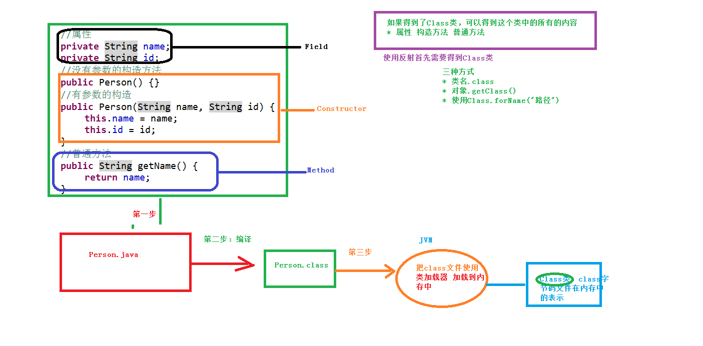

# 反射与内省

<!-- TOC -->

- [反射与内省](#%E5%8F%8D%E5%B0%84%E4%B8%8E%E5%86%85%E7%9C%81)
  - [反射 (Reflect)](#%E5%8F%8D%E5%B0%84-reflect)
    - [反射的原理](#%E5%8F%8D%E5%B0%84%E7%9A%84%E5%8E%9F%E7%90%86)
    - [使用反射操作属性](#%E4%BD%BF%E7%94%A8%E5%8F%8D%E5%B0%84%E6%93%8D%E4%BD%9C%E5%B1%9E%E6%80%A7)
    - [使用反射操作构造函数](#%E4%BD%BF%E7%94%A8%E5%8F%8D%E5%B0%84%E6%93%8D%E4%BD%9C%E6%9E%84%E9%80%A0%E5%87%BD%E6%95%B0)
      - [无参数构造方法](#%E6%97%A0%E5%8F%82%E6%95%B0%E6%9E%84%E9%80%A0%E6%96%B9%E6%B3%95)
      - [有参数构造方法](#%E6%9C%89%E5%8F%82%E6%95%B0%E6%9E%84%E9%80%A0%E6%96%B9%E6%B3%95)
    - [使用反射操作方法](#%E4%BD%BF%E7%94%A8%E5%8F%8D%E5%B0%84%E6%93%8D%E4%BD%9C%E6%96%B9%E6%B3%95)
      - [实例方法](#%E5%AE%9E%E4%BE%8B%E6%96%B9%E6%B3%95)
      - [静态方法](#%E9%9D%99%E6%80%81%E6%96%B9%E6%B3%95)
  - [内省 (Introspector)](#%E5%86%85%E7%9C%81-introspector)
    - [JavaBean的规范](#javabean%E7%9A%84%E8%A7%84%E8%8C%83)
    - [Introspector操作JavaBean](#introspector%E6%93%8D%E4%BD%9Cjavabean)
    - [使用BeanUtils](#%E4%BD%BF%E7%94%A8beanutils)
      - [设置JavaBean属性：`BeanUtils.setProperty(bean, propertyName, propertyValue)`](#%E8%AE%BE%E7%BD%AEjavabean%E5%B1%9E%E6%80%A7beanutilssetpropertybean-propertyname-propertyvalue)
      - [获取JavaBean属性：`BeanUtils.getProperty(bean, propertyName)`](#%E8%8E%B7%E5%8F%96javabean%E5%B1%9E%E6%80%A7beanutilsgetpropertybean-propertyname)
      - [封装Map数据到JavaBean对象中：`BeanUtils.populate(bean, map)`](#%E5%B0%81%E8%A3%85map%E6%95%B0%E6%8D%AE%E5%88%B0javabean%E5%AF%B9%E8%B1%A1%E4%B8%ADbeanutilspopulatebean-map)
  - [反射和内省的区别](#%E5%8F%8D%E5%B0%84%E5%92%8C%E5%86%85%E7%9C%81%E7%9A%84%E5%8C%BA%E5%88%AB)

<!-- /TOC -->

## 反射 (Reflect)

在框架开发中，都是基于配置文件开发的，在配置文件中配置了类，可以通过读取配置文件中的类名，然后通过反射得到类中的所有内容，或是让类中的某个方法来执行。

也就是说，反射是在运行时获取一个类的所有信息，可以获取到 .class 的任何定义的信息（包括成员 变量，成员方法，构造器等）可以操纵类的字段、方法、构造器等部分。

### 反射的原理

我们将通过下图对反射的原理进行说明：



- **得到 class 文件**
  - 把 java 文件保存到本地硬盘，得到 .java 文件
  - 编译 java 文件，得到 .class 文件
  - JVM 把 .class 文件加载到内存中，class 文件在内存中使用 Class 类表示
- **通过 class 文件得到 Class 类**，可以通过以下 3 种方式获得 Class 类
  - 通过成员变量获得： `类名.class`
  - 通过具体对象获得： `对象.getClass()`
  - 通过 Class 的静态方法获取： `Class.forName("classFilePath")`
- **通过 Class 类获取 class 文件中的内容，包括：成员变量，构造方法，普通方法**，它们都可以用相应的类表示：
    - 成员方法：`Field`
    - 构造方法：`Constructor`
    - 普通方法：`Method`

### 使用反射操作属性

```java
public void test3() {
    try {
        Class c2 = Class.forName("cn.itcast.test09.Person");  // 得到Class类
        Person p11 = (Person) c2.newInstance();  // 得到Person类的对象，返回
        Field[] fields = c2.getDeclaredFields();  // 得到所有的属性，返回一个Field数组
        Field f1 = c2.getDeclaredField("name");  // 得到属性，参数是属性的名称

        // 如果操作的是私有的属性，不让操作，可以通过setAccessible(true)操作私有属性
        f1.setAccessible(true);
        f1.set(p11, "wangwu"); // 设置name值，相当于p.name = "wangwu";
        System.out.println(f1.get(p11)); // 相当于 p.name
    }catch(Exception e) {
        e.printStackTrace();
    }
}
```

### 使用反射操作构造函数

#### 无参数构造方法

通过 Class 对象的 `newInstance()` 方法创建。

```java
public void test1() throws Exception {
    Class c3 = Class.forName("cn.itcast.test09.Person");
    // 无参数的构造方法就是直接使用newInstance()方法
    Person p = (Person) c3.newInstance();
    p.setName("zhangsan");
    System.out.println(p.getName());
}
```

#### 有参数构造方法

不能再通过 Class 对象的 `newInstance()` 方法创建了，要先得到要调用的构造函数的 Consturctor 对象，然后通过 Constructor 对象的 `newInstance()` 方法创建。

```java
public void test2() throws Exception {
    Class c1 = Class.forName("cn.itcast.test09.Person");

    // 获取所有的构造方法
    Constructor[] css = c1.getConstructors();
    // 获取特定的构造方法：传递是有参数的构造方法里面参数类型，类型使用class的形式传递
    Constructor cs = c1.getConstructor(String.class, String.class);

    // 通过有参数的构造方法创建Person实例，而不是通过Class的对象
    Person p1 = (Person) cs.newInstance("lisi","100");
    System.out.println(p1.getId()+" "+p1.getName());
}
```


### 使用反射操作方法

#### 实例方法

```java
public void test4() throws Exception {
    Class c4 = Class.forName("cn.itcast.test09.Person");
    Person p4 = (Person) c4.newInstance();

    // 得到所有的普通方法
    Method[] mds = c4.getDeclaredMethods();
    // 得到特定的普通方法，传递两个参数：第一个参数：方法名称；第二个参数：方法里面参数的类型
    Method m1 = c4.getDeclaredMethod("setName", String.class);

    // 使用invoke执行方法，传递两个参数：第一个参数：person实例；第二个参数：设置的值
    // 在这里要传入person对象的原因是：我们需要知道到底是哪一个对象的setName方法执行了
    // 如果要操作的是私有的方法 ，需要 m1.setAccessible(true);
    m1.invoke(p4, "niuqi");
    System.out.println(p4.getName());
}
```

#### 静态方法

静态方法调用方式是 `类名.方法名`，不需要类的实例，所以使用反射操作静态方式时候，也是不需要实例的，在 invoke 方法的第一个参数传入 null 即可： `m1.invoke(null, "niuqi");`


## 内省 (Introspector)

内省是基于反射实现的，主要用于操作 JavaBean，相比反射使用起来要方便一些。可以获取 bean 的 getter/setter 方法，也就是说，只要 JavaBean 有 `getXxx()` 方法，不管这个 Bean 有没有 Xxx 属性，使用内省我们都认为它有。

为了更好的理解，我们先来介绍一下 JavaBean 的规范。

### JavaBean 的规范

- 必须要有一个默认构造器。
- 提供 get/set 方法，如果只有 get 方法，那么这个属性是只读属性。
- 属性：有 get/set 方法的成员，还可以没有成员，只有 get/set 方法。属性名称由 get/set 方法来决定，而不是成员名称。
- 方法名称满足一定的规范，它就是属性！boolean 类型的属性，它的读方法可以是 is 开头，也可以是 get 开头。

### Introspector 操作 JavaBean

**操作示例：**

```java
BeanInfo beanInfo = Introspector.getBeanInfo(User.class);
PropertyDescriptor[] pds = beanInfo.getPropertyDescriptors();
```

每个 PropertyDescriptor 对象对应一个 JavaBean 属性：

- `String getName()`：获取 JavaBean 属性名称；
- `Method getReadMethod()`：获取属性的读方法；
- `Method getWriteMethod()`：获取属性的写方法。

然后再调用`invoke(params...)`就可以操作 JavaBean 了。

### 使用 BeanUtils

我们并不需要真的自己通过 Introspector 来获取 JavaBean 的实例，我们可以通过现成的工具：BeanUtils 来操作 JavaBean。想要使用 BeanUtils，我们需要先导入 commons-beanutils.jar 包，然后，我们便可以通过 BeanUtils 来操纵 JavaBean 了。

#### 设置 JavaBean 属性：`BeanUtils.setProperty(bean, propertyName, propertyValue)`

```java
User user = new User();
BeanUtils.setProperty(user, "username", "admin");
BeanUtils.setProperty(user, "password", "admin123");
```

#### 获取 JavaBean 属性：`BeanUtils.getProperty(bean, propertyName)`

```java
User user = new User("admin", "admin123");
String username = BeanUtils.getProperty(user, "username");
String password = BeanUtils.getProperty(user, "password");
```

#### 封装 Map 数据到 JavaBean 对象中：`BeanUtils.populate(bean, map)`

```java
Map<String, String> map = new HashMap<String,String>();
map.put("username", "admin");
map.put("password", "admin123");
User user = new User();
BeanUtils.populate(user, map);
```


## 反射和内省的区别

反射就像给类照镜子，这个的所有信息会毫无保留的反射到镜子中，将这个类的所有信息照出来，能照出来就是有，照不出来就是没有，得到的东西都是客观真实存在的。

而内省的目的是找出 bean 的 getter 和 setter 以便操作这个 bean，所以只要看到有 getter 或者 setter 就认为这个类有那么一个字段，比如看到 getName() 内省就会认为这个类中有 name 字段，但事实上并不一定会有 name。


